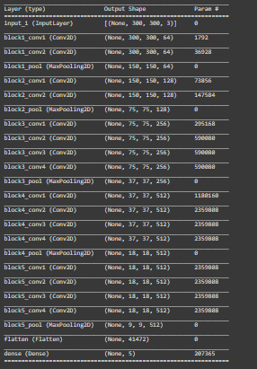
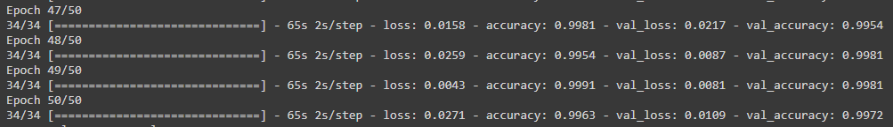
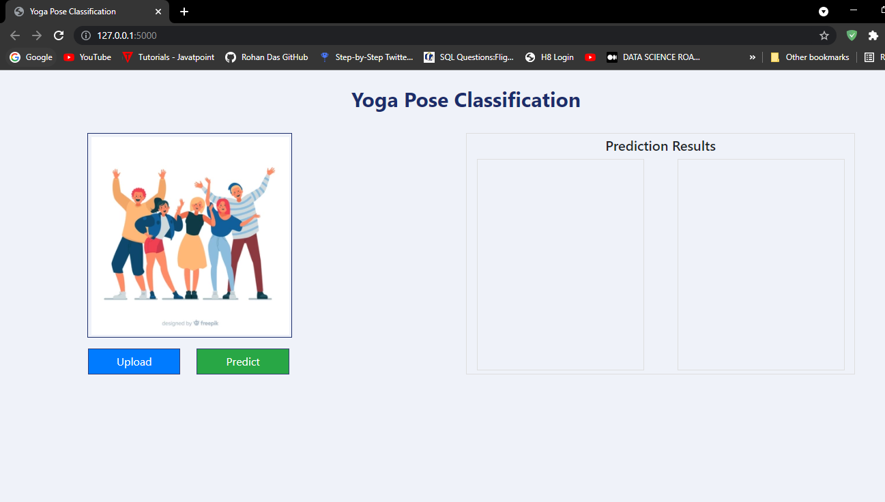
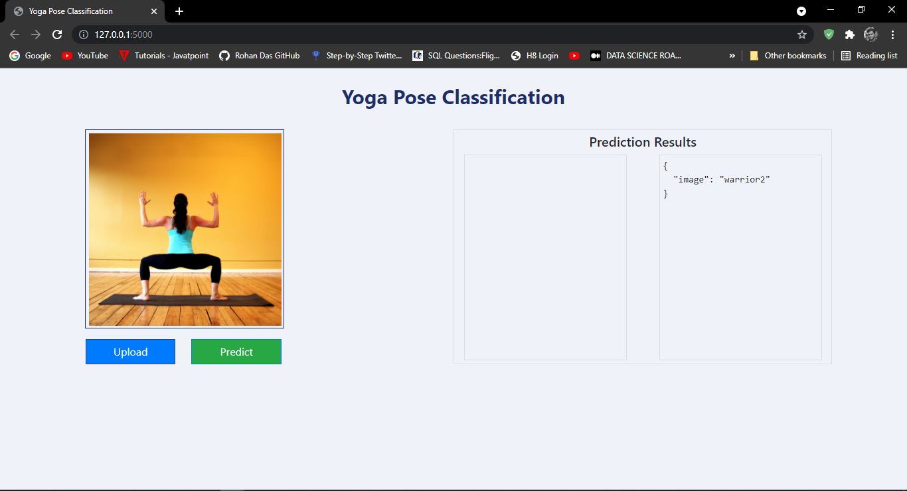

## Yoga Image Classification Using VGG19

### Image classification is huge area. With the advancement of the new cnn architecture, image classification can be done in a very efficient way.

#### In this repo I will be taking about the custom image classification using VGG19 pretrained model.

* Dataset :
    I got this dataset from kaggle. [Here](https://www.kaggle.com/niharika41298/yoga-poses-dataset)
    
    This dataset contains 5 class :

        1. downdog

        2. godess

        3. plank

        4. tree

        5. warrior2

* Pretrained Model Download:

    For this experiment I have selected VGG19 pretrained model. You can search more from [here](https://keras.io/api/applications/vgg/#vgg19-function).
    As VGG19 pretrained model selects image size of 224*224, during the preprocessing of the image I have reduced some custom image size to see how it works. 

The Architecture is something like this:

* Training:

    I uploaded the local code in google colab and executed from there using free gpu.
    After running the pretrained model for 50 epochs I got the new model by which I'll create a webapp and do prediction.

* Training Evaluation:
    By running the VGG19 pretrained model with the custom images I got validation accuracy approx 99.7 %

* Verification Locally:

    After doing the training i saved the moddel in the local.
    Also created an API using Flask for image uploading and predicting.

    Click on upload and select a picture.

    

    Finally click the Predict button to see the classification result.

    
    

  
